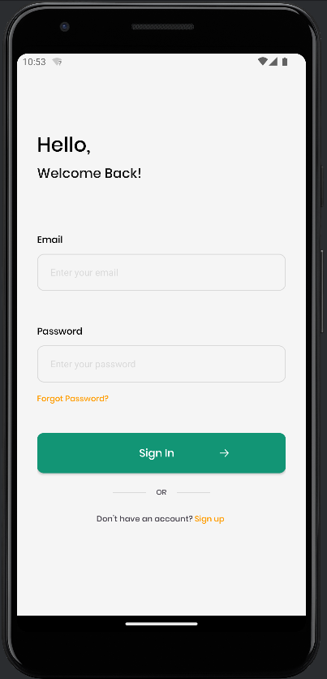

# Recipe Finder App

## Introduction
Welcome to the Recipe Finder App! This application is designed to help you discover new and delicious recipes effortlessly. Whether you're a seasoned chef or a home cook, our user-friendly interface make it easy to find recipes that suit your tastes and dietary preferences.

## Features
- **Search Functionality:** Easily find recipes by entering keywords or specific ingredients.

## Technologies Used
- **Frontend:** Android (Java), XML
- **Database:** Firebase Database
- **API Integration:** Edamam (for recipe search), Firebase (for authentication and user data storage), Retrofit library (for retrieving data from Firebase)

## API Integration
- **Edamam:** The Recipe Finder App integrates with the Edamam API to provide users with an extensive database of recipes. Users can search for recipes based on keywords, ingredients, or dietary preferences.
  
## Authentication and User Data
- **Firebase:** Firebase is used for authentication and storing user data securely. Users can sign up and log in to the app using Firebase Authentication. Their preferences, favorite recipes, and other data are stored in Firebase's Realtime Database or Firestore.

## Data Retrieval
- **Retrofit Library:** Retrofit is used for retrieving data from Firebase in the Recipe Finder App. Retrofit simplifies the process of making network requests and handling responses in Android applications.

## Screenshots

  

    <h3>Splash Screen</h3>
    
  

  

    <h3>Login Page</h3>
    
  

  

    <h3>Sign Up Page</h3>
    
  

  

    <h3>Home Page</h3>
    
  

